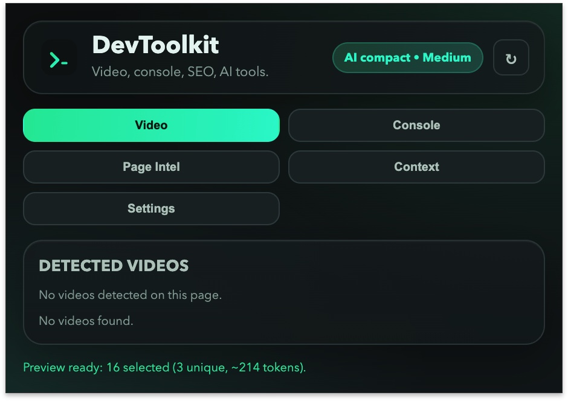

# DevToolkit Extension

Chrome MV3 extension that combines:
- video stream detection and download workflows
- console capture utilities
- page intelligence helpers
- AI-assisted developer tooling

## Project Preview

## Features

- Multi-source video candidate detection (`watcher.js` + `content-script.js`)
- Per-tab persisted video cache and curation (`background.js`)
- Popup actions for direct download and MP3-availability flow (`popup.js`)
- Optional local `yt-dlp` + `ffmpeg` bridge for one-click fallback extraction (`tools/local-downloader-server.mjs`)
- Host-level permissions for broad page coverage (`manifest.json`)

## Local yt-dlp Helper (Optional, Recommended)

For YouTube/TikTok and other stream types that are not directly downloadable in-browser:

1. Install tools on macOS:
   - `brew install yt-dlp ffmpeg`
2. Start helper:
   - `node tools/local-downloader-server.mjs`
3. In extension `Settings`:
   - Enable bridge fallback (URL is fixed to `http://192.168.4.15:38086`)

When direct download is unavailable, `Download` / `Audio` buttons automatically fall back to local extraction.

### Use Existing Unraid `youtube-dl-server`

The bridge target is hardcoded to `http://192.168.4.15:38086`, so your existing Unraid `youtube-dl-server` container is used directly.

The extension auto-detects helper type:
- `DevToolkit helper`: expects `/health`, `/download-video`, `/extract-audio`
- `youtube-dl-server`: expects `/youtube-dl` and queues via `/youtube-dl/q`

## Docs

- Status and architecture: `docs/VIDEO_DOWNLOADER_STATUS.md`
- Detailed implementation changes: `docs/changes/2026-02-15-video-download-overhaul.md`
- Planning notes: `docs/plans/2026-02-15-unified-extension-plan.md`
